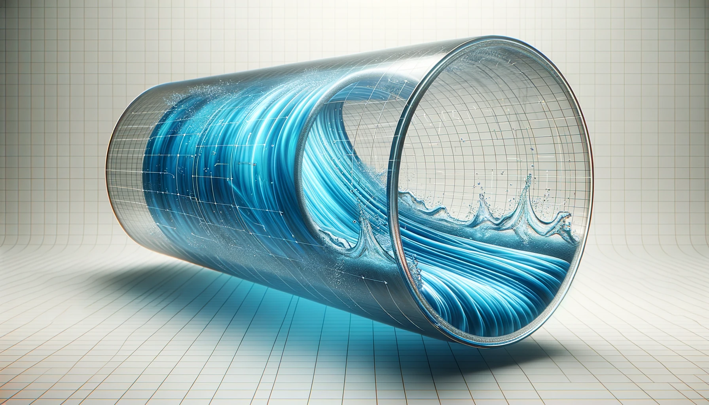
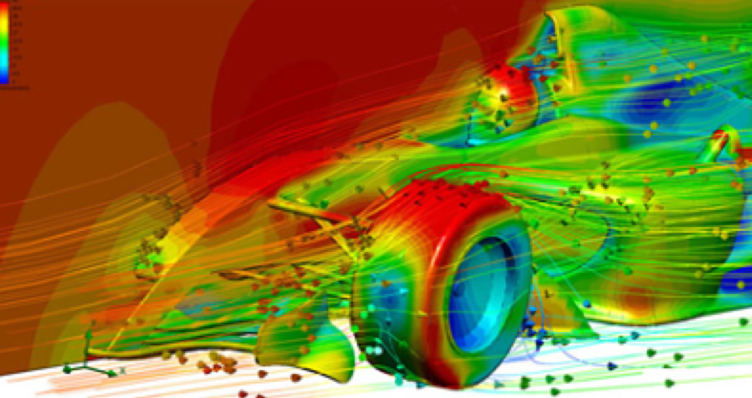

# Lab 1 - Modelling Flow in Pipes

## Introduction

Understanding the behavior of fluid flow in is a critical aspect of various engineering applications ranging from avionics to chemical processing plants. Accurate simulation of these flows is essential to design efficient systems, predict system behavior under different conditions,and troubleshoot operations. In this lab, we will delve into the mathematical and computational aspects of modeling fluid flow in pipes, focusing on the Navier-Stokes equations as the foundation of our simulation models.

_Figure 1: A pool of tasks completed based on scheduling_

## Navier-Stokes Equations

The Navier-Stokes equations are a set of equations that describe how the velocity field of a fluid evolves over time. They are an extension of Newton's second law of motion to fluid flow and incorporate the principles of conservation of mass, momentum and energy. In
the generalized form (time-dependent and compressible flow) the Navier-Stokes equations is given by Eq 1 and Eq 2:
Mass Conservation Equation:

$$ \frac{\partial \rho}{\partial t} + \nabla \cdot (\rho \mathbf{u}) = 0 (1)$$

Momentum Conservation Equation:

$$
 \quad \rho \left( \frac{\partial \mathbf{u}}{\partial t} + \left( \mathbf{u} \cdot \nabla \right) \mathbf{u} \right) = -\nabla p + \nabla \cdot \tau + \mathbf{F}    (2)
$$

Here, $\rho$ is the fluid density, $\mathbf{u}$ is velocity vector, $p$ is pressure, $\tau$ stress tensor and $\mathbf  {F}$ is external force and is often gravity. The gradient operator for 3D coordinate system is given by

$$
\nabla =\left({\partial  \over \partial x},{\partial  \over \partial y},{\partial  \over \partial z}\right)  (3)
$$

The gradient operator $(\nabla)$ in cylindrical coordinates takes the form:

$$
\nabla = (\frac{\partial}{\partial r}, \frac{1}{r} \frac{\partial}{\partial \theta}, \frac{\partial}{\partial z}  ) (4)
$$

Additionally, compressible liquids require conservation of energy formulation.

If you are looking for a quick million dollars, then solving Eq 1 and Eq 2, or showing existence of regular solutions, gets you that from Clay Mathematics Institute along with possibly a Fields Medal in mathematics.
In 2D, incompressible Navier-Stokes solutions are known to exist and remain smooth indefinitely (free of singularities).
In 3D, however, we still don’t know if smooth solutions always exist even for the case of incompressible flow.

_Figure 2: Surface velocities on race car body showing flow trajectories (Source: Mentor Graphics)_

### Conservation of Mass

For a finite volume V, the mass contained in the volume is given by:

$$ m = ∫_V \rho dV $$

where $ρ$ is the density of the fluid. The rate of change of mass in the volume is given by:

$$ d/dt ∫_V ρ dV = -∮_S \rho u ⋅ dS $$

where $u$ is the velocity vector and $S$ is the surface of the volume.

Now using Divergence theorem:

> Divergence theorem connects **local divergence within a volume** (the "sources" or "sinks" of field) to the **total flux across the surface** bounding the volume.
> It shifts our perspective from needing to understand each tiny detail inside a region to just measuring the effect on the boundary.

$$ ∮_S ρ u ⋅ dS = ∫_V ∇ ⋅ (ρ u) dV $$

Now, the rate of change of mass in the volume is given by:

$$ d/dt ∫_V ρ dV = -∫_V ∇ ⋅ (ρ u) dV $$

Since above equation has to be true for any arbitrary $V$, we get:

$$ \frac{\partial \rho}{\partial t} + ∇ ⋅ (\rho u) = 0 $$

### Conservation of Momentum

By second law of Newton, the rate of change of momentum in a volume is given by:

$$
\frac{D\rho\vec{u}}{D t} = \text{Sum of forces on the fluid element}
$$

where $\vec{v}$ is the velocity vector and $D/Dt$ is the material derivative. The material derivative is the total derivative of a quantity with respect to time, and it accounts for the change in the quantity due to both the change in time and the change in position of the fluid element.
The material derivative is given by:

$$
\frac{D \phi}{D t} = \frac{\partial \phi}{\partial t} + \frac{\partial \phi}{\partial x} \frac{dx}{dt} + \frac{\partial \phi}{\partial y} \frac{dy}{dt} + \frac{\partial \phi}{\partial z} \frac{dz}{dt}
$$

where $\phi$ is the quantity of interest and $x, y, z$ are the spatial coordinates, thus we have:

$$
\frac{D \phi}{D t} = \frac{\partial \phi}{\partial t} + u \frac{\partial \phi}{\partial x} + v \frac{\partial \phi}{\partial y} + w \frac{\partial \phi}{\partial z}
$$

And in the vector form, the material derivative is given by:

$$
\frac{D \phi}{D t} = \frac{\partial \phi}{\partial t} + (\vec{u} \cdot \nabla) \phi
$$

For conservation of momentum, the quantity of interest is the momentum vector $\rho\vec{u}$, thus we have:

$$
\frac{D \rho\vec{u}}{D t} = \frac{\partial \rho\vec{u}}{\partial t} + (\vec{u} \cdot \nabla) \rho\vec{u}
$$

The forces acting on unit volume are given by:

$$
\vec{f}_{\text{pressure}} = -\nabla p
$$

For newtonian fluids, the viscous force is given by:

$$
\vec{f}_{\text{viscous}} = \mu \nabla^2 \vec{v}
$$

where $\mu$ is the dynamic viscosity of the fluid.
Assuming, gravity is the only external force acting on the fluid, the body force is given by:

$$
\vec{f}_{\text{body}} = \rho \vec{g}
$$

Thus, the momentum conservation equation is given by:

$$
\frac{\partial \rho\vec{u}}{\partial t} + (\vec{u} \cdot \nabla) \rho\vec{u} = -\nabla p + \mu \nabla^2 \vec{v} + \rho \vec{g}
$$

## Incompressible Flow

In many practical situations, especially in pipe flows where the fluid is moving at moderate speeds, we can make the following assumptions:

1. Incompressible Flow: The fluid density is constant. Mathematically, $\rho = \text{constant}$ and

$$\nabla \cdot \mathbf{u} = 0 (5)$$

2. Newtonian Fluid: The fluid has a constant viscosity $\mu$, i.e., the relationship between the shear stress and shear rate is linear.

For incompressible Newtonian fluid, the stress tensor in Eq 2 is given by Eq 6.

$$
\nabla \cdot \boldsymbol \tau = \mu \nabla ^ 2 \mathbf{u} (6)
$$

With above assumption and considering that gravity as the only external force acting on the fluid, the Eq 2 simplifies to

$$
\rho  ( \frac{\partial (\mathbf {u})}{\partial t} +\mathbf {u} \cdot \nabla \mathbf {u}) = -\nabla p + \mu \nabla^2 \mathbf{u} + \rho \mathbf{g} (7)
$$

### Flow in a pipe

In cylindrical coordinates, the velocity vector $\mathbf{u}$ has components $(u_r, u_{\theta}, u_z)$, corresponding to the $r, \theta, z$ directions. Mass conservation equation i.e. Eq 1 in cylindrical coordinates is given by Eq 8

$$
\frac{1}{r} \frac{\partial (r u_r)}{\partial r} + \frac{1}{r} \frac{\partial u_{\theta}}{\partial \theta} + \frac{\partial u_z}{\partial z} = 0 (8)
$$

The Eq 2 for Newtonian fluids in cylindrical coordinates can be broken down into its three components:

Radial Component $u_r$,

$$
\rho \left( \frac{\partial u_r}{\partial t} + u_r \frac{\partial u_r}{\partial r} + u_{\theta} \frac{1}{r} \frac{\partial u_r}{\partial \theta} + u_z \frac{\partial u_r}{\partial z} \right) = -\frac{\partial p}{\partial r} + \mu \left[ \nabla^2 u_r - \frac{u_r}{r^2} - \frac{2}{r^2} \frac{\partial u_{\theta}}{\partial \theta} \right] + F_r
(9)
$$

Azimuthal Component $u_{\theta}$,

$$
\rho \left( \frac{\partial u_{\theta}}{\partial t} + u_r \frac{\partial u_{\theta}}{\partial r} + u_{\theta} \frac{1}{r} \frac{\partial u_{\theta}}{\partial \theta} + u_z \frac{\partial u_{\theta}}{\partial z} \right) = -\frac{1}{r} \frac{\partial p}{\partial \theta} + \mu \left[ \nabla^2 u_{\theta} - \frac{u_{\theta}}{r^2} + \frac{2}{r^2} \frac{\partial u_{r}}{\partial \theta} \right] + F_{\theta}
(10)
$$

Axial Component $u_z$,

$$
\rho \left( \frac{\partial u_z}{\partial t} + u_r \frac{\partial u_z}{\partial r} + u_{\theta} \frac{1}{r} \frac{\partial u_z}{\partial \theta} + u_z \frac{\partial u_z}{\partial z} \right) = -\frac{\partial p}{\partial z} + \mu \nabla^2 u_z + F_z (11)
$$

Here, $\nabla^2$ is the Laplacian operator in cylindrical coordinates, and $F_r, F_\theta, F_z$ are the body force components in the respective directions.In these equations, $\nabla^2$ for each component in cylindrical coordinates will be:

For $u_r$:

$$
\nabla^2 u_r = \frac{\partial^2 u_r}{\partial r^2} + \frac{1}{r} \frac{\partial u_r}{\partial r} + \frac{1}{r^2} \frac{\partial^2 u_r}{\partial \theta^2} + \frac{\partial^2 u_r}{\partial z^2}(12)
$$

For $u_\theta$:

$$
\nabla^2 u_{\theta} = \frac{\partial^2 u_{\theta}}{\partial r^2} + \frac{1}{r} \frac{\partial u_{\theta}}{\partial r} + \frac{1}{r^2} \frac{\partial^2 u_{\theta}}{\partial \theta^2} + \frac{\partial^2 u_{\theta}}{\partial z^2}(13)
$$

For $u_z$:

$$
\nabla^2 u_z = \frac{\partial^2 u_z}{\partial r^2} + \frac{1}{r} \frac{\partial u_z}{\partial r} + \frac{1}{r^2} \frac{\partial^2 u_z}{\partial \theta^2} + \frac{\partial^2 u_z}{\partial z^2}(14)
$$

These are the Navier-Stokes equations for an incompressible fluid in cylindrical coordinates, accounting for the general case including time dependence, radial, azimuthal and axial velocities, and external body forces.

Fortunately, for time invariant flow (steady state) using the following assumptions simplifies down the Eq 11 considerably.

**Incompressible Flow**: Density $\rho$ is constant.

**Steady-State**: $\frac{\partial}{\partial t} = 0$.

**Axisymmetric Flow**: $\frac{\partial}{\partial \theta} = 0$ and $u_\theta = 0$

**Fully Developed**: $\frac{\partial u_z}{\partial z} = 0$ but $\frac{\partial p}{\partial z} \neq 0$

**No Radial Velocity**: $u_r = 0$

**Newtonian Fluid**: $mu$ is constant.

### Finite Difference Method for Solving Navier-Stokes Equation

We can approximate the derivatives using finite difference methods:

$$
\
\frac{\partial^2 u_z}{\partial r^2} \approx \frac{u_{z,i+1} - 2u_{z,i} + u_{z,i-1}}{\Delta r^2} (15)
$$

$$
\frac{\partial u_z}{\partial r} \approx \frac{u_{z,i+1} - u_{z,i}}{\Delta r} (16)
$$

The above finite difference equation can be represented as a system of linear equations $\mathbf{Au} = \mathbf{b}$.

## References

- Munson, B. R., Young, D. F., Okiishi, T. H., & Huebsch, W. W. (2012). Fundamentals of Fluid Mechanics. John Wiley & Sons.
