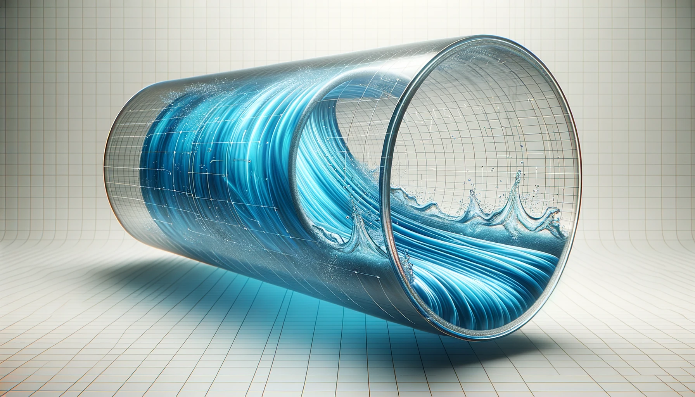

# Lab 1 - Computational Fluid Dynamics Modelling Flow in Pipes

## Introduction

Understanding the behavior of fluid flow in is a critical aspect of various engineering applications ranging from avionics to chemical processing plants. Accurate simulation of these flows is essential to design efficient systems, predict system behavior under different conditions,and troubleshoot operations. In this lab, we will delve into the mathematical and computational aspects of modeling fluid flow in pipes, focusing on the Navier-Stokes equations as the foundation of our simulation models.

*Figure 1: A pool of tasks completed based on scheduling*

## Navier-Stokes Equations

The Navier-Stokes equations are a set of equations that describe how the velocity field of a fluid evolves over time. They are an extension of Newton's second law of motion to fluid flow and incorporate the principles of conservation of mass, momentum and energy. In
the generalized form (time-dependent and compressible flow) the Navier-Stokes equations is given by Eq 1 and Eq 2:
Mass Conservation Equation:
Equation (1):

$$ \frac{\partial \rho}{\partial t} + \nabla \cdot (\rho \mathbf{u}) = 0    (1)$$

Momentum Conservation Equation:
Equation (2):

$$
 \quad \rho \left( \frac{\partial \mathbf{u}}{\partial t} + \left( \mathbf{u} \cdot \nabla \right) \mathbf{u} \right) = -\nabla p + \nabla \cdot \tau + \mathbf{F}    (2)
$$

Here, $\rho$ is the fluid density, $\mathbf{u}$ is velocity vector, $p$ is pressure, $\tau$ stress tensor and $\mathbf  {F}$ is external force and is often gravity. The gradient operator for 3D coordinate system is given by 

$$ 
\nabla =\left({\partial  \over \partial x},{\partial  \over \partial y},{\partial  \over \partial z}\right)  (3)
$$

The gradient operator \(\nabla\) in cylindrical coordinates takes the form:

$$
\nabla = (\frac{\partial}{\partial r}, \frac{1}{r} \frac{\partial}{\partial \theta}, \frac{\partial}{\partial z}  ) (4)$$

Additionally, compressible liquids require conservation of energy formulation. 

If you are looking for a quick million dollars, then solving Eq 1 and Eq 2 gets you that from Clay Mathematics Institute along with possibly a Fields Medal in mathematics.

*Figure 2: Surface velocities on race car body showing flow trajectories (Source: Mentor Graphics)*
## Incompressible Flow
In many practical situations, especially in pipe flows where the fluid is moving at moderate speeds, we can make the following assumptions:

1. Incompressible Flow: The fluid density is constant. Mathematically, $\rho = \text{constant}$ and 

$$\nabla \cdot \mathbf{u} = 0 (5)$$

2. Newtonian Fluid: The fluid has a constant viscosity $\mu$, i.e., the relationship between the shear stress and shear rate is linear.

For incompressible Newtonian fluid, the stress tensor in Eq 2 is given by Eq 6.

$$
\nabla \cdot \boldsymbol \tau = \mu \nabla ^ 2 \mathbf{u} (6)
$$

With above assumption and considering that gravity as the only external force acting on the fluid, the Eq 2 simplifies to

$$
\rho  ( \frac{\partial (\mathbf {u})}{\partial t} +\mathbf {u} \cdot \nabla \mathbf {u}) = -\nabla p + \mu \nabla^2 \mathbf{u} + \rho \mathbf{g} (7)
$$

### Flow in a pipe
In cylindrical coordinates, the velocity vector $\mathbf{u}$ has components $(u_r, u_{\theta}, u_z)$, corresponding to the  $r, \theta, z$ directions. Mass conservation equation i.e. Eq 1 in cylindrical coordinates is given by Eq 8

$$ 
\frac{1}{r} \frac{\partial (r u_r)}{\partial r} + \frac{1}{r} \frac{\partial u_{\theta}}{\partial \theta} + \frac{\partial u_z}{\partial z} = 0 (8)
$$

The Eq 2 for Newtonian fluids in cylindrical coordinates can be broken down into its three components:

Radial Component $u_r$,

$$
\rho \left( \frac{\partial u_r}{\partial t} + u_r \frac{\partial u_r}{\partial r} + u_{\theta} \frac{1}{r} \frac{\partial u_r}{\partial \theta} + u_z \frac{\partial u_r}{\partial z} \right) = -\frac{\partial p}{\partial r} + \mu \left[ \nabla^2 u_r - \frac{u_r}{r^2} - \frac{2}{r^2} \frac{\partial u_{\theta}}{\partial \theta} \right] + F_r
(9)
$$

Azimuthal Component $u_{\theta}$,

$$
\rho \left( \frac{\partial u_{\theta}}{\partial t} + u_r \frac{\partial u_{\theta}}{\partial r} + u_{\theta} \frac{1}{r} \frac{\partial u_{\theta}}{\partial \theta} + u_z \frac{\partial u_{\theta}}{\partial z} \right) = -\frac{1}{r} \frac{\partial p}{\partial \theta} + \mu \left[ \nabla^2 u_{\theta} - \frac{u_{\theta}}{r^2} + \frac{2}{r^2} \frac{\partial u_{r}}{\partial \theta} \right] + F_{\theta}
(10)
$$

Axial Component  $u_z$,

$$ 
\rho \left( \frac{\partial u_z}{\partial t} + u_r \frac{\partial u_z}{\partial r} + u_{\theta} \frac{1}{r} \frac{\partial u_z}{\partial \theta} + u_z \frac{\partial u_z}{\partial z} \right) = -\frac{\partial p}{\partial z} + \mu \nabla^2 u_z + F_z (11)
$$

Here, $\nabla^2$ is the Laplacian operator in cylindrical coordinates, and $F_r, F_\theta, F_z$ are the body force components in the respective directions.In these equations,  $\nabla^2$ for each component in cylindrical coordinates will be: 

For $u_r$: 

$$
\nabla^2 u_r = \frac{\partial^2 u_r}{\partial r^2} + \frac{1}{r} \frac{\partial u_r}{\partial r} + \frac{1}{r^2} \frac{\partial^2 u_r}{\partial \theta^2} + \frac{\partial^2 u_r}{\partial z^2}(12)
$$

For $u_\theta$: 

$$
\nabla^2 u_{\theta} = \frac{\partial^2 u_{\theta}}{\partial r^2} + \frac{1}{r} \frac{\partial u_{\theta}}{\partial r} + \frac{1}{r^2} \frac{\partial^2 u_{\theta}}{\partial \theta^2} + \frac{\partial^2 u_{\theta}}{\partial z^2}(13)
$$

For $u_z$:

$$
\nabla^2 u_z = \frac{\partial^2 u_z}{\partial r^2} + \frac{1}{r} \frac{\partial u_z}{\partial r} + \frac{1}{r^2} \frac{\partial^2 u_z}{\partial \theta^2} + \frac{\partial^2 u_z}{\partial z^2}(14)
$$

These are the Navier-Stokes equations for an incompressible fluid in cylindrical coordinates, accounting for the general case including time dependence, radial, azimuthal and axial velocities, and external body forces.

Fortunately, for time invariant flow (steady state) using the following assumptions simplifies down the Eq 11 considerably.

**Incompressible Flow**: Density $\rho$ is constant.
**Steady-State**: $\frac{\partial}{\partial t} = 0$.
**Axisymmetric Flow**: $\frac{\partial}{\partial \theta} = 0$ and $u_\theta = 0$
**Fully Developed**: $\frac{\partial u_z}{\partial z} = 0$ but $\frac{\partial p}{\partial z} \neq 0$
**No Radial Velocity**: $u_r = 0$
**Newtonian Fluid**: $mu$ is constant.

### Finite Difference Method for Solving Navier-Stokes Equation

We can approximate the derivatives using finite difference methods:

$$\
\frac{\partial^2 u_z}{\partial r^2} \approx \frac{u_{z,i+1} - 2u_{z,i} + u_{z,i-1}}{\Delta r^2} (15)
$$

$$   
\frac{\partial u_z}{\partial r} \approx \frac{u_{z,i+1} - u_{z,i}}{\Delta r} (16)
$$
    
The above finite difference equation can be represented as a system of linear equations $\mathbf{Au} = \mathbf{b}$.

## Tasks

### Task 1

Model steady-state and full-developed axial flow of incompressible Newtonian fluid in cylindrical pipe assuming axisymmetric flow with no radial velocity. 

* Formulate the PDE by simplifying the Navier Strokes equations for cylindrical coordinates.  
* Convert the PDE into difference  equation using Eq 15 and Eq 16.

  
### Task 2

Write a Python program to solve the system of linear equations obtained from difference equations to solve for $u_z$ as a function of $r$, and plot the  $u_z$ as a function of  $r$ to visualize the velocity profile in the pipe for the Boundary condition and Parameters given below.

#### Boundary Conditions
* At $r = 0$, $\frac{\partial u_z}{\partial r} = 0$
* At $r = R$, $u_z = 0$
* At $z = 0$, $u_z = 15$
* At $z = L$, $u_z = 15$

#### Parameters
* Pipe Diameter $D = 0.1$ m
* Pipe Length $L = 1$ m
* Viscosity $\mu = 0.01$ kg/m.s
* Constant pressure gradient $\frac{\partial p}{\partial z} = -100$ Pa/m
* Choose $N = 100$ (or more) grid points
* Base viscosity $\mu_0 = 0.05$ kg/m.s
* Temperature expansion coefficient $\alpha = 0.08$ 1/K
* Reference temperature $T_0 = 273$ K
* $\beta$ = $5$ K/m$^2$
* $\gamma$ = 0.25

### Task 3 

Write a Python program to model flow in pipe, where viscosity of the fluid is temperature dependent given by Eq 17, and the temperature varies with radius as given by Eq 18.

$$\mu(T) = \mu_0 (1 + \alpha (T - T_0))(17)$$
    
$$T(r) = T_0 + \beta r^2 (18)$$

### Task 4

Consider the model for the flow of an incompressible Newtonian fluid in a pipe where the velocity profile $u_z$ varies with both radial ($r$) and axial ($z$) coordinates, according to Eq 19. 

* Write Python program to solve the system of linear equations obtained by converting the Eq 19 into difference equation.  
* Create a a 3D plot of velocity profile as a function of both radial ($r$) and axial ($z$) coordinates.

$$\mu \left( \frac{\partial^2 u_z}{\partial r^2} + \frac{1}{r} \frac{\partial u_z}{\partial r} \right) + \gamma \frac{\partial^2 u_z}{\partial z^2} = \frac{\partial p}{\partial z}
(19)$$

### Deliverable

1. Three Python scripts, one for each task.
2. Report describing your approach, understanding of continuous dynamics modelling, and your observations.

### Evaluation Criteria

* Correct implementation of the finite difference equation.    
* Successful solving of the system of linear equations.
* Interpretation of the results.
* Quality of report.

